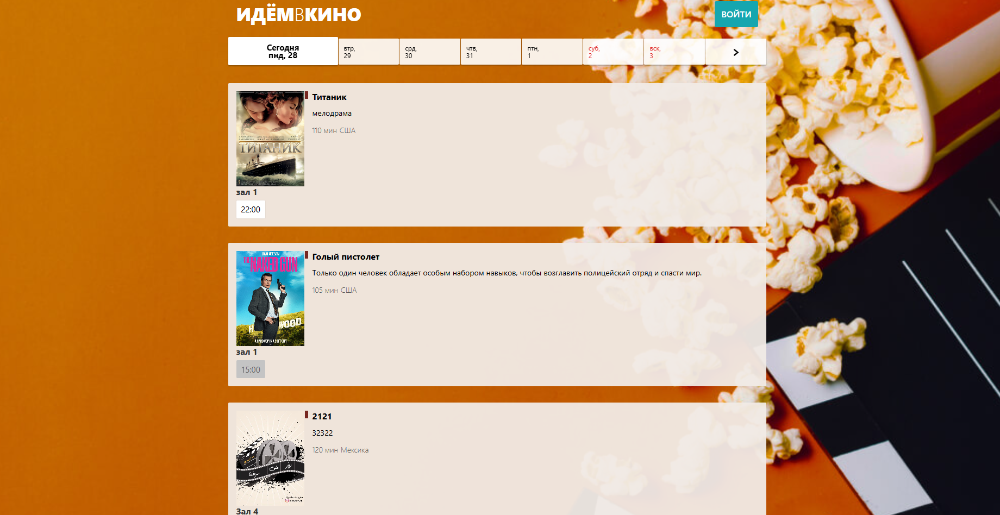
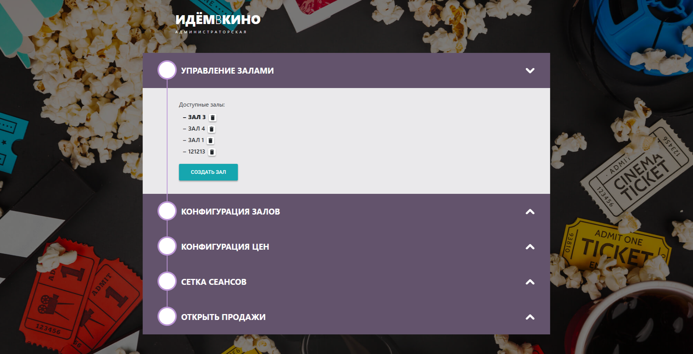

# Дипломная работа по профессии Frontend-разработчик

## Технологический стек

- [x] **Языки**: `TypeScript`, `SCSS`.

- [x] **Фреймворки и библиотеки**:
  - **Frontend**: `React` (v19), `React Router` (v7), `Vite`.

  - **Стилизация**: `SCSS`, `Bootstrap` (кастомная сборка).

  - **API**: `Axios` для HTTP-запросов.

  - **Дополнительные библиотеки**:
    - `date-fns` — работа с датами.

    - `react-icons` — иконки.

    - `react-toastify` — всплывающие уведомления.

    - `qrcode.react` — генерация QR-кодов.

- [x] **Сервер**:
  - Прокси-сервер (`vite.config.ts`) для API (`https://shfe-diplom.neto-server.ru`).

- [x] **Сборка и инструменты**:
  - `Vite` — быстрая сборка проекта.

  - `ESLint` + `Prettier` — линтинг и форматирование кода.

  - `TypeScript` — статическая типизация.

## Особенности проекта

  - **Валидация** данных (к примеру, проверка конфликтов сеансов).

  - **Адаптивный дизайн** для работы на мобильных устройствах.

## Ссылки на условия работы и готовый проект

- [x] [Условия дипломной работы](https://github.com/netology-code/shfe-diplom 'Ссылка на задание по дипломному проекту')<br>
- [x] [Развернутый проект на GitHub - Гостевая страница](https://nikolay87-ru.github.io/js-advanced-diploma/ 'Ссылка на проект')<br>
- [x] [Развернутый проект на GitHub - Страница администратора](https://nikolay87-ru.github.io/js-advanced-diploma/ 'Ссылка на проект')

## Основные модули и их функционал

### 1. Гостевой интерфейс

Гостевой интерфейс — для просмотра фильмов, выбора сеансов и бронирования билетов.

**Принцип работы**:

- Пользователь выбирает дату в календаре.

- Видит список доступных фильмов и сеансов.

- Выбирает сеанс, места в зале и бронирует билеты.

- Получает QR-код для входа.



- [x] **Главная страница** (`GuestPage`):
  - Отображает список фильмов с постерами, описанием и сеансами.

  - Позволяет выбрать дату с помощью календаря (`Calendar`).

  - Фильтрует сеансы по выбранной дате.

- [x] **Страница зала** (`HallPage`):
  - Показывает схему зала с местами (обычные, VIP, заблокированные).

  - Позволяет выбрать места и перейти к бронированию.

- [x] **Страница билета** (`TicketPage`):
  - Отображает информацию о бронировании (фильм, места, стоимость).

  - Генерирует QR-код для подтверждения брони.

### 2. Административный интерфейс

Административный интерфейс — для управления залами, фильмами, сеансами и настройки цен.

**Принцип работы**:

- Администратор настраивает залы (ряды, места, цены).

- Добавляет фильмы и сеансы, избегая конфликтов.

- Управляет продажами (включает/выключает для залов).



- [x] **Страница авторизации** (`LoginPage`):
  - Отображает форму авторизации для доступа к админ-панели.

  - **Логин** - `shfe-diplom@netology.ru`.

  - **Пароль** - `shfe-diplom`.

- [x] **Страница администратора** (`AdminPanel`):
  - Содержит нижеперечисленные компоненты, обернутые в компонент (аккордеон-панель) с функцией раскрытия/закрытия (`AdminAccordionSection`) ⬇️.
  - **Управление залами** (`HallsManagement`):
    - Добавление залов с помощью попапа (`AddHallPopup`).
    - Удаление и выбор залов.
    - Компонент выбора залов (`HallsList`) является общим и для других секции (**HallConfig**, **HallPrices**, **HallOpen**), 
      обеспечивая тем самым работу с одним залом во всей админ-панели, без необходимости переключения зала в каждой секции.

  - **Конфигурация залов** (`HallConfig`):
    - Настройка рядов, мест и типов кресел (обычные, VIP, заблокированные).

  - **Конфигурация цен** (`HallPrices`):
    - Установка цен для разных типов мест.

  - **Сетка сеансов** (`SeancesGridSection`):
    - Добавление фильмов с помощью попапа (`AddMoviePopup`).
    - Удаление фильмов.
    - Перетаскивание сеансов на временную шкалу с помощью **Drag-and-drop** и попапа (`AddSeancePopup`).
    - Удаление сеансов.
    - Проверка сеансов на конфликты.

  - **Открытие продаж** (`HallOpenSection`):
    - Включение/выключение продаж билетов для залов.

### 3. Общие компоненты

- [x] **Авторизация** (`AuthContext`):
  - Вход для администратора через логин/пароль.

- [x] **Контексты** (`HallsContext`, `GuestContext`):
  - Хранение и обновление данных о залах, фильмах и сеансах.

- [x] **API** (`api.ts`):
  - Запросы к серверу для управления данными.

## Запуск проекта и валидация

1. **Установка зависимостей**:

```bash
npm install
```

2. **Запуск клиентской части**:

```bash
npm run dev
```

3. **Сборка проекта**:

```bash
npx vite build
```

4. **Просмотр собранной версии** (адрес: http://localhost:5173):

```bash
npm run preview
```

5. **Валидация** (одновременный запуск тестов lint, type-check, jest):

```bash
npm run validate
```

## Юнит тест
